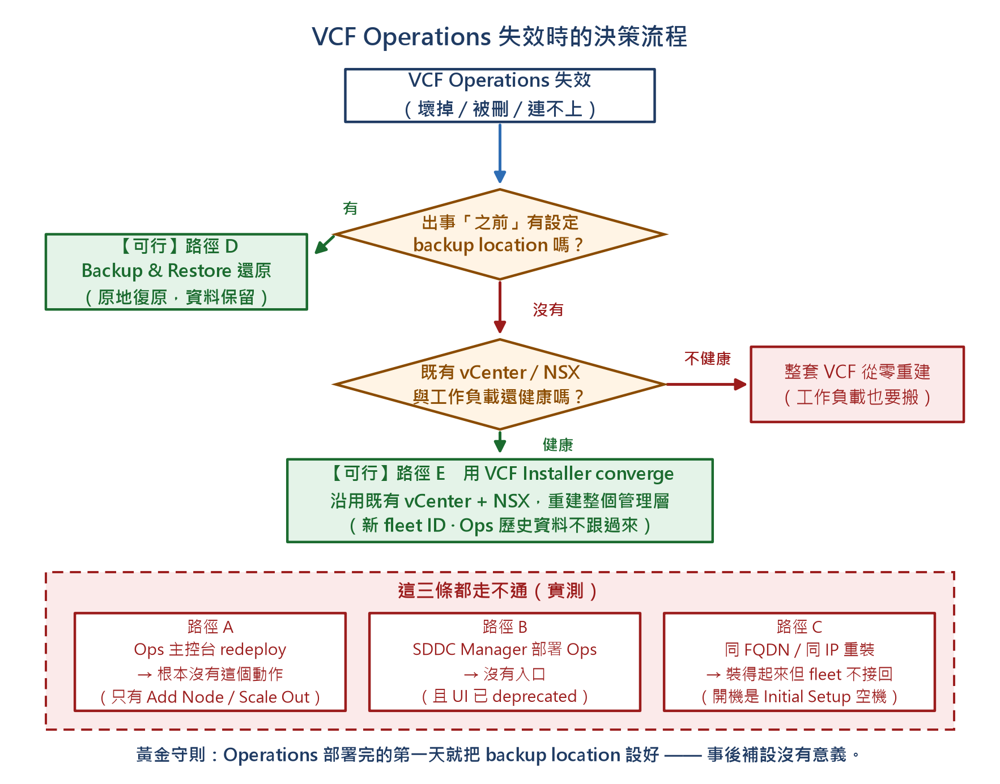
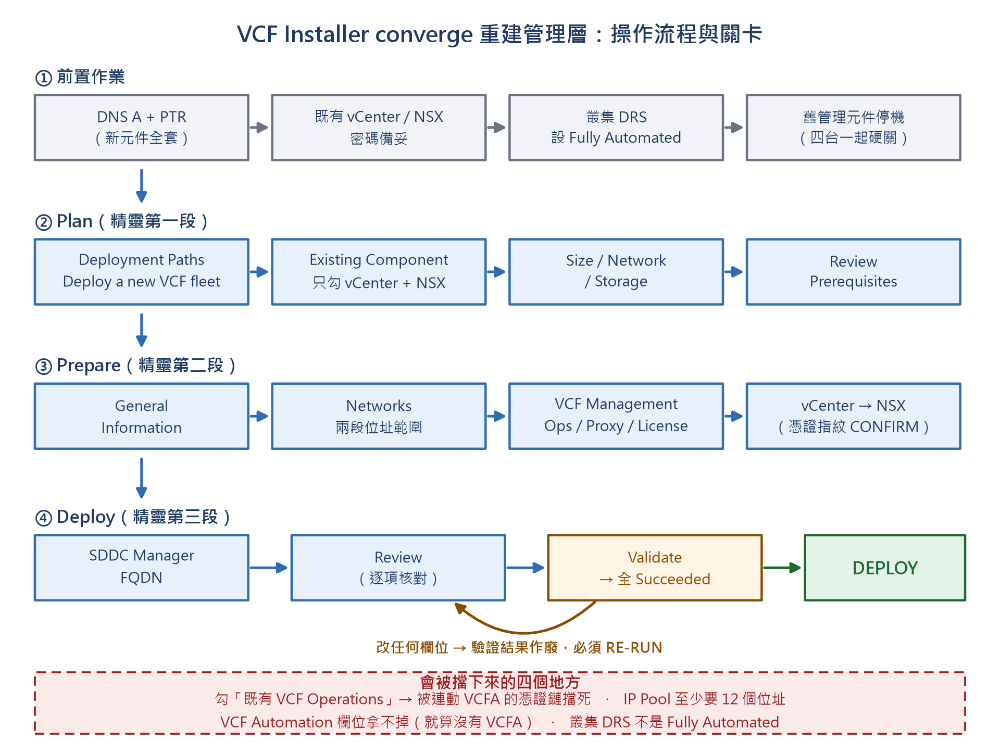
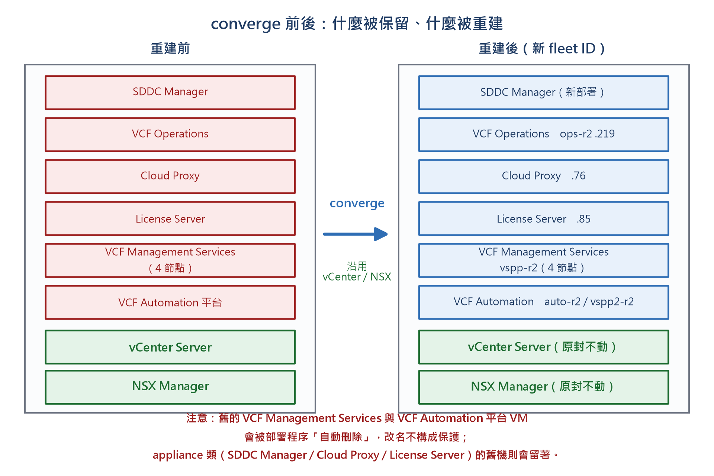
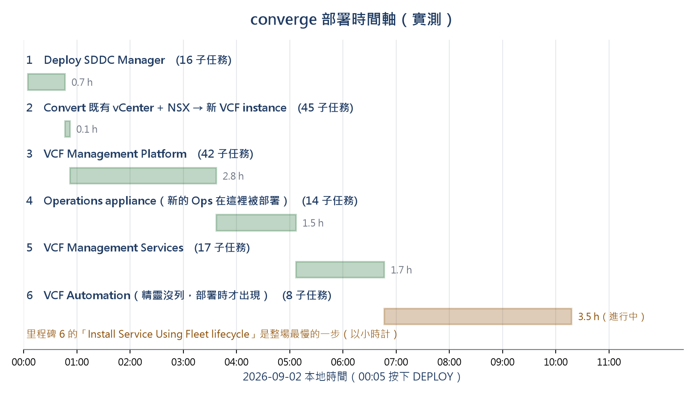

# 08 — VCF Operations 掛了 / 管理層要重建（converge 既有 vCenter+NSX）

> 實測環境：rtolab `vcf-m02`（VCF 9.1.0.0，不含 VCFA 消費層），2026-09-01～09-02。
> 這篇回答一個很常被問、答案卻違反直覺的問題：**「VCF Operations 壞了，能不能拆掉重裝？」**
> 簡短版：**不行。** 9.1 沒有「移除 / 重新部署 Operations」這個動作。往下看你有哪些路。

---

## 🚦 這篇的症狀路由

| 你看到的症狀 | 跳到 |
|---|---|
| VCF Operations 壞了 / 被刪了，想知道怎麼救回來 | [§1 五條路的結論表](#1-五條路的結論表) |
| 在 Ops / SDDC Manager UI 找不到 remove / redeploy | [§2 為什麼找不到](#2-為什麼-ui-上找不到移除重新部署) |
| 重裝了一台同 FQDN 同 IP 的 Ops，fleet 卻不認 | [§3 同名重裝無效](#3-同名同-ip-重裝-fleet-不會接回去) |
| 打了 `https://<ops>` 出現「Aria Operations 不可用…修復叢集」→ 導到 `newCluster.action` | [§3](#3-同名同-ip-重裝-fleet-不會接回去) |
| Ops 剛裝好、443 通了但 Initial Setup 說 `node is not in a state suitable for configuration` | [§3.1 443 通 ≠ 就緒](#31-443-通--服務就緒) |
| 要重建整個管理層但不想動 vCenter / NSX / 工作負載 | [§4 converge 操作流程](#4-converge既有-vcenternsx--重建管理層) |
| converge 精靈勾了 Ops 之後噴 `getting certificate chain for ...:443` | [§4.2 勾 Ops 是死路](#42-死路一勾了-i-have-an-existing-vcf-operations) |
| Networks 頁被擋：`IP Pool should be at least 12` | [§4.3 兩段 IP range](#43-networks-兩段位址範圍都是必填) |
| 明明沒有 VCFA，精靈卻硬要 VCF Automation 的 FQDN / CIDR | [§4.4 VCFA 拿不掉](#44-vcfa-欄位拿不掉) |
| Review 頁顯示 `Deployment specification has been changed. Validation needs to be re-run.` | [§4.5 驗證會過期](#45-驗證結果會過期改欄位就要-re-run) |
| 驗證失敗 `Cluster does not have DRS fully automated` | [§4.6 DRS 必須 Fully Automated](#46-唯一真正的驗證失敗drs-要-fully-automated) |
| **VSP supervisor VM 關掉後「自己又開回來」** | [§5 互相救援不是有鬼](#5-vsp-supervisor-vm-自己開回來的真相) |
| **park 的舊 VM 被自動刪掉了** | [§4.9 沒有回頭路](#49-️按下-deploy-就沒有回頭路舊-vsp--vcfa-平台-vm-會被自動刪除) |
| 部署後登不進新元件（不知道密碼） | [§4.7 自動產生的密碼](#47-自動產生的密碼一定要匯出) |

---

## 1. 五條路的結論表




| # | 路徑 | 結果 | 原因 / 訊息 |
|---|---|---|---|
| A | Ops 主控台內建 redeploy / repair | ❌ **不存在** | 介面只有 Add Node / Scale Out |
| B | SDDC Manager 重新部署 Ops | ❌ **沒有入口** | SDDC Manager 無此功能，且 9.1 已標 deprecated |
| C | 手動同版 OVA、同 FQDN/IP 重裝 | ⚠️ **裝得起來但接不回** | 開機導向 `/admin/newCluster.action` 全新安裝精靈 |
| D | **Backup & Restore 還原** | ✅ 官方支援 | ⚠️ **必須「事前」設好 backup location** |
| E | **VCF Installer → converge 既有 vCenter/NSX，重建管理層** | ✅ 實測可行 | 見 §4 |

> **黃金守則**：Ops 部署完的第一天就把 **backup location 設好**。事後才想到備份＝沒有還原來源，
> 只能走 §4 重建（新 fleet ID、Ops 歷史資料不會跟過來）。

---

## 2. 為什麼 UI 上找不到「移除 / 重新部署」

- **VCF Operations 主控台**：Fleet Management 與節點頁只有 `Add Node` / `Scale Out`，沒有任何 remove / redeploy / repair。
- **SDDC Manager**：生命週期管理只處理既有元件更新，**沒有**「部署一台 VCF Operations」的入口；9.1 更把這個 UI 標為 deprecated（方向是全部集中到 Ops 主控台）。
- **SDDC Manager API**：也**沒有** Ops 的 decommission / redeploy 端點。

VCF 9.1 的設計是：**Operations 是 fleet 的中央管理主控台**，它的復原走**備份還原**，不走「拆掉重裝」。

---

## 3. 同名同 IP 重裝 → fleet 不會接回去

實測（路徑 C）：從離線 depot 拿**同一 build** 的 OVA（`Operations-Appliance-9.1.0.0400.25541561.ova`），
沿用原 FQDN / IP / 規格重新部署。

```
18:58  匯入 OVA
19:06  開機
19:15  443 可回應（firstboot ≈ 9 分鐘）
19:15  https://<ops>/ → 「VMware Aria Operations 不可用…登入管理 UI 以設定、檢查或修復叢集」
       → 自動導向 /admin/newCluster.action ＝「VCF Operations Initial Setup」全新安裝精靈
```

**結論：它就是一台空機。** fleet 對 Ops 的註冊與資料只存在原本那台的資料庫裡，沒有備份就沒有來源。

### 3.1 443 通 ≠ 服務就緒

Initial Setup 一開始會跳 **`The node is not in a state suitable for configuration`** —— firstboot
內部服務還沒起完（估 20–40 分鐘）。判斷「Ops 真的好了沒」不要看 443/HTTP 200，要打 suite-api：

```bash
# 取 token（成功才代表 API 起來了）
curl -sk -X POST https://<ops>/suite-api/api/auth/token/acquire \
  -H 'Content-Type: application/json' -H 'Accept: application/json' \
  -d '{"username":"admin","password":"<pw>"}'

# 再確認節點狀態必須是 ONLINE
curl -sk https://<ops>/suite-api/api/deployment/node/status \
  -H "Authorization: vRealizeOpsToken <token>" -H 'Accept: application/json'
```

---

## 4. converge：既有 vCenter+NSX ＋ 重建管理層




**適用**：Ops（或整個管理層）救不回、也沒有備份，但 **vCenter / NSX / 工作負載都還健康**。

**代價（先講清楚）**
- 會產生**新的 fleet（新 ID）**；舊 Ops 歷史資料不跟過來。
- 舊 SDDC Manager / 管理服務在 vCenter 內的註冊要**先清乾淨**（VCF 沒有官方 decommission 流程）。
- 新管理元件要**一組全新的 FQDN / IP**（舊名稱與 VIP 仍被舊元件佔用）。
- **既有 vCenter / NSX 會被沿用，VM 不受影響。**



### 4.0 前置檢查表

1. VCF Installer 可登入（rtolab：`https://192.168.114.5`）。
2. 新元件的 **DNS A + PTR 都建好並實際解析驗證過**（正解、反解都要）。
3. 既有 vCenter 的 SSO 管理員密碼、既有 NSX 的 admin / root / audit 密碼備妥。
4. **目標叢集 DRS = Fully Automated**（否則驗證必失敗，見 §4.6）。
5. 舊管理元件已停機 —— **四台管理服務節點要「同時」硬關**（見 §5）。

rtolab 本輪用的新名稱（`-r2` 後綴避開被佔用的舊 VIP）：

| FQDN | IP | 用途 |
|---|---|---|
| `kosten-vcf91-fleet-r2` | .215 | Fleet |
| `kosten-vcf91-vsp-r2` | .216 | VCF Management Services |
| `kosten-vcf91-vspp-r2` | .217 | Management Services Platform |
| `kosten-vcf91-auto-r2` | .218 | VCF Automation |
| `kosten-vcf91-ops-r2` | .219 | VCF Operations |
| `kosten-vcf91-vidb-r2` | .220 | Identity Broker |
| `kosten-vcf91-vspp2-r2` | .221 | VCF Automation runtime |

### 4.1 精靈路徑

`VCF Installer → DEPLOYMENT WIZARD → VMware Cloud Foundation`
→ **Deployment Paths 選第一項 `Deploy a new VCF fleet`**（說明文字就寫了 *Converging Existing Components*）。

三個選項的 DOM id（寫自動化時對照，**原廠拼錯的 `worload` 不要自己「修正」**）：

| 選項 | id |
|---|---|
| Deploy a new VCF fleet（converge 走這個） | `worload-type-VCF` |
| Deploy a new VCF Instance | `worload-type-VCF_EXTEND` |
| Deploy deferred components | `worload-type-VCF_COMPLETE` |

**Plan → Existing Component** 四個勾選項：

| 勾選項（id） | 意義 |
|---|---|
| I have an existing VCF Operations 9.1 instance（`clr-form-control-5`） | 既有 Ops 當新 fleet 的中央主控台 |
| I have an existing vCenter instance（`clr-form-control-4`） | 既有 vCenter 當管理網域 vCenter |
| The vCenter instance is registered with NSX Manager（`clr-form-control-6`） | 沿用該 vCenter 註冊的 NSX（要先勾 vCenter 才亮） |
| I have an existing VCF Automation instance or I will deploy later（`clr-form-control-7`） | 連既有或稍後部署 VCFA |

### 4.2 死路一：勾了「I have an existing VCF Operations」

若目標是**不保留舊 Ops**，**千萬不要勾這項**。勾了之後精靈會自動偵測與該 Ops 連動的 VCFA 並要求它可連線，
就算改填新 FQDN 也會噴：

```
Error occurred while getting certificate chain for 'kosten-vcf91-auto-r2.rtolab.local:443'
```

✅ **正解：只勾 vCenter ＋「已註冊 NSX Manager」，Ops 讓它全新部署。**

### 4.3 Networks：兩段位址範圍都是必填

- **VCF management services IP pool** —— 只給 8 個會被擋：**`IP Pool should be at least 12`**。本輪用 `.225–240`。
- **VCF Automation IP Range** —— 第二段，**也是必填**，容易漏。本輪用 `.241–252`。

### 4.4 VCFA 欄位拿不掉

即使這套「不含 VCFA」，Prepare 階段的 **VCF Automation FQDN / IP range / node prefix / internal CIDR 仍是必填**。
與建置時「`vspClusterSpec` 無法從 spec 移除」是同一件事 —— 9.1 把它視為平台的一部分。

### 4.5 驗證結果會過期（改欄位就要 RE-RUN）

回頭改任何欄位後，Review 頁會顯示：

```
Deployment specification has been changed. Validation needs to be re-run.
```

**必須按 RE-RUN**，不能沿用舊結果。

### 4.6 唯一真正的驗證失敗：DRS 要 Fully Automated

```
Existing Components   Failed
  Cluster does not have DRS fully automated
```

```powershell
# 修法：把管理叢集 DRS 改成 FullyAutomated，再回 installer 按 RE-RUN
Set-Cluster -Cluster 'vcf-m02-cl01' -DrsAutomationLevel FullyAutomated -Confirm:$false
```

修完 RE-RUN → 全 Succeeded（會留兩個 warning：資源不足提醒、使用自動產生的密碼）。

### 4.7 自動產生的密碼一定要匯出

未提供密碼的元件由 installer **自動產生**。Review 頁與部署進度頁都有 **`REVIEW PASSWORDS`**，
可 **Copy all passwords in: json / csv**。**部署當下就匯出留存，否則之後登不進新元件。**

### 4.8 部署里程碑（共 134 子任務）

| # | 里程碑 | 子任務 |
|---|---|---|
| 1 | Deploy SDDC Manager | 16 |
| 2 | **Convert the existing vCenter with existing NSX to a new VCF instance** | 45 |
| 3 | Deploy and configure VCF Management Platform | 42 |
| 4 | Deploy and configure the operations appliance | 14 |
| 5 | Deploy and configure VCF Management Services | 17 |



### 4.9 ⚠️ 按下 DEPLOY 就沒有回頭路：舊 VSP / VCFA 平台 VM 會被自動刪除

實測：舊管理元件只做了「關機＋改名 `-OLD-<日期>`」（**沒有人手動刪**），但部署過程自行移除了：

```
00:52:40-42  Removed kosten-vcf91-vspp-{2j7n4,jw9xp,l5jwx,pkjn9}-OLD-20260901   ← 4 台舊 VSP 節點
06:46:34     Removed vcf-services-runtime-template-9.1.0.0200.25555874          ← 範本
06:46:37     Removed kosten-vcf91-vcfa-platform-8jcj4-OLD-20260901              ← 舊 VCFA 平台
08:20:42     Removed bootstrap-vm-cNw85G                                        ← CAPV bootstrap（正常）
```

仍存活（關機）：`sddc-OLD` / `ops-coll-OLD` / `lic-OLD` —— **appliance 類的舊元件不會被動**。

> **改名不是保護**。VSP / VCFA 平台這類「由 supervisor（CAPV）管理」的 VM，converge 開跑後會被回收。
> 真的要留退路，**事前另外冷備份**（匯出 OVF 或快照另存），不能只靠 park。

```powershell
# 事後查是誰刪的
Get-VIEvent -Start (Get-Date).AddHours(-22) -MaxSamples 20000 |
  Where-Object { $_.FullFormattedMessage -match 'Removed' } |
  Sort-Object CreatedTime | ForEach-Object { "[{0}] {1}" -f $_.CreatedTime, $_.FullFormattedMessage }
```

### 4.10 部署時會多冒出第 6 個里程碑

精靈的 Review 只列 5 個里程碑，實際部署會多出 **`Deploy and configure VCF Automation`（8 子任務）**。
其中 `Install Service Using Fleet lifecycle` 是整場最慢的一步（巢狀儲存上以**小時**計）。
判斷「還在跑 vs 卡死」不要只看 UI，看 VCFA runtime 節點與 supervisor 的 CPU：

```powershell
Get-Stat -Entity (Get-VM '*vspp2*') -Stat cpu.usage.average -Start (Get-Date).AddMinutes(-40) |
  Measure-Object Value -Average -Maximum      # 有負載＝在裝
```

---

## 5. VSP supervisor VM「自己開回來」的真相

**症狀**：把 VSP 的 supervisor VM 關掉，過一陣子（觀察到約 30 分鐘）它們自己又開回來了，
像是有什麼背景機制在拉。

**排查**：用兩輪盯梢（12 分鐘、60 分鐘）觀察 + 抓 `Get-VIEvent` 發起者 + 檢查 `managedBy`：

- **沒有**任何 EAM agency / extension 標記（`Config.ManagedBy` 是空的）。
- 兩輪盯梢期間**都沒有再復發**。

**根因**：不是有定時機制，而是 **supervisor 叢集自我修復** ——
**一台一台優雅關機時，還活著的節點會把已經關掉的節點救回來**。

✅ **正解：四台在數秒內「一起硬關」。**

```powershell
# 同時硬關（不要一台一台 Shutdown-VMGuest）
Get-VM -Name '*vspp*' | Stop-VM -Confirm:$false
Start-Sleep 10
Get-VM -Name '*vspp*' | Select Name, PowerState    # 確認全部 PoweredOff
```

---

## 6. 移除 Ops 要用可回復的做法（park，不要刪）

測試 / 演練時模擬「元件消失」，用 **優雅關機 + 改名**（例：加 `-OLD-<日期>` 後綴），**不要刪 VM**：

- 對 fleet 而言，「VM 關機且 FQDN 連不上」與「被刪掉」效果一樣，足以測出影響。
- 但你隨時可以改回名字、開機救回原環境（實測 100% 還原成功）。
- 改名也避免之後「同名重裝」在 vCenter 內撞名。

---

## 7. 沒測到的部分（誠實記錄）

**授權鏈影響測不出來**：該環境全程是 **Evaluation Mode**，沒有真授權，
所以「Ops 消失會不會導致 vCenter / ESXi 掉授權」**無法量測**。要回答這題必須在有真實授權的環境重驗。

---

## 相關

- 完整測試報告 + 可照做的操作手冊（含每一步截圖）：rtolab 端 `dev-docs/vcf91-ops-rebuild/VCF9.1-Ops-Removal-and-Rebuild.docx`
- VSP supervisor 其他故障：[05-vsp-supervisor.md](05-vsp-supervisor.md)
- bringup 本身失敗：[04-bringup-failures.md](04-bringup-failures.md)
